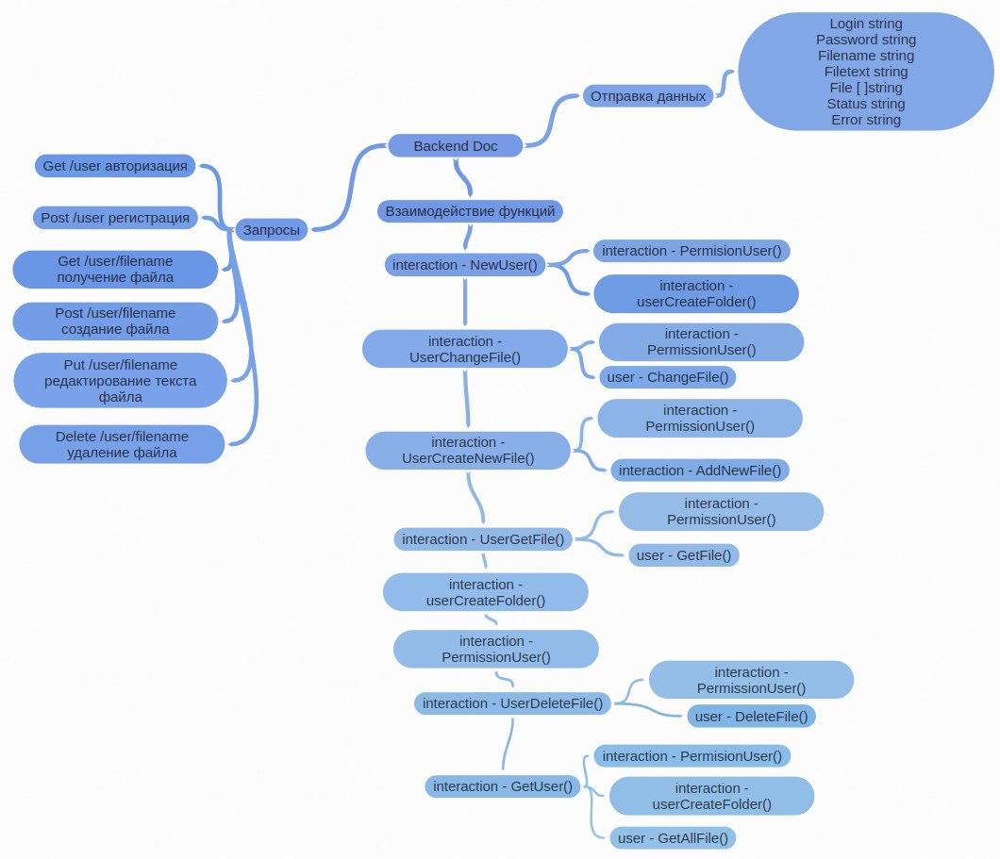

# backend-docx

<ul>
    <li>GET /:user -- авторизация и получение данных</li>
    <li>POST /:user -- регистрация и получение данных</li>
    <li>GET /:user/:file?filename -- получение конкретного файла</li>
    <li>PUT /:user/:file?filename -- сохранить изменение файла</li>
    <li>POST /:user/:file?filename -- создать файл</li>
    <li>DELETE /:user/:file?filename -- удалить файл</li>
</ul>
<h3>Структура проекта:</h3>

